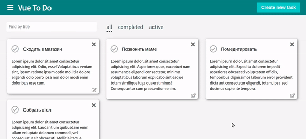

# To-do list



Клиентская часть to-do приложения на Vue.js.

**Стек**: Vue.js, Vuex, Packery (grid).

[Посмотреть работу](https://panicswtch.github.io/vue-to-do/)

## Функционал:
1. Можно добавлять и удалять списки задач.
2. Можно переключаться между списками и добавлять в них задачи, либо удалять их.
3. Есть возможность фильтровать задачи по статусу выполнения и по названию.
4. Состояние приложения сохраняется в общем store.
5. Для построения гибкой сетки использована библиотека Packery.
6. Есть возможность переносить задачи между группами.

## Как можно улучшить:
1. Подключить базу данных;
3. Добавить функцию копирования задач и списков;
4. Добавить функцию редактирования названия задач и списков.

## Установка
```
npm install
```

### Открыть в браузере
```
npm run serve
```

### Сборка в продакшн
```
npm run build
```